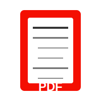
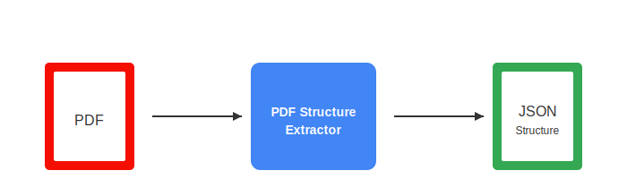
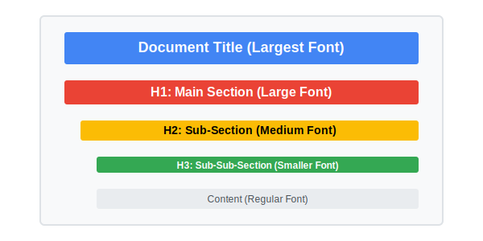
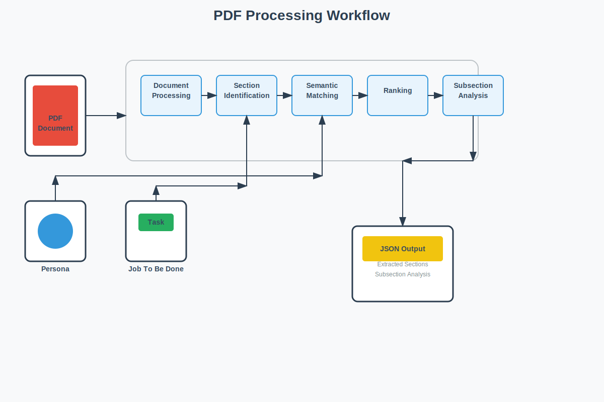
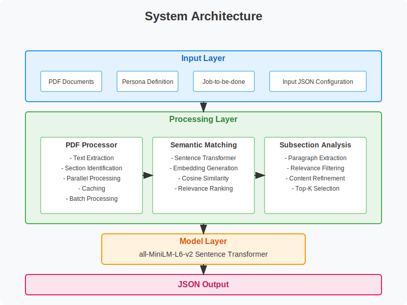
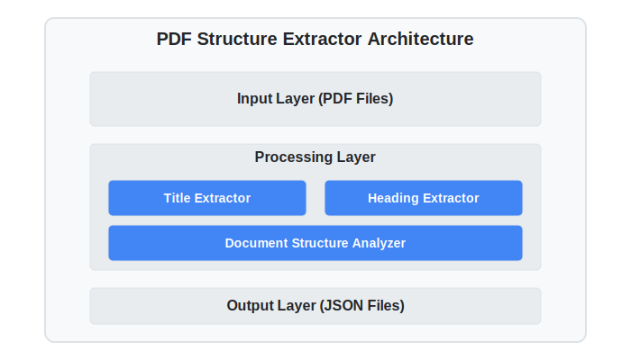
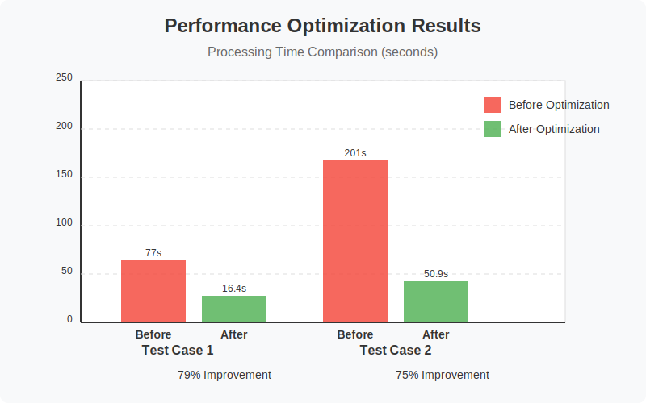

# Adobe India Hackathon 2025: Connecting the Dots Challenge

<div align="center">



**Rethink Reading. Rediscover Knowledge.**

[](https://www.docker.com/)
[](https://www.python.org/)
[](https://opensource.org/licenses/MIT)

</div>

## 🌟 Welcome to the "Connecting the Dots" Challenge

What if every time you opened a PDF, it didn't just sit there—it spoke to you, connected ideas, and narrated meaning across your entire library?

That's the future we're building — and we want you to help shape it.

In the Connecting the Dots Challenge, our mission is to reimagine the humble PDF as an intelligent, interactive experience—one that understands structure, surfaces insights, and responds like a trusted research companion.

## 🚀 The Journey

**Round 1:**
Kick things off by building the brains — extract structured outlines from raw PDFs with blazing speed and pinpoint accuracy. Then, power it up with on-device intelligence that understands sections and links related ideas together.

**Round 2:**
It's showtime! Build a beautiful, intuitive reading webapp using Adobe's PDF Embed API. You will be using your Round 1 work to design a futuristic webapp.

## 💡 Why This Matters

In a world flooded with documents, what wins is not more content — it's context. We're not just building tools — we're building the future of how we read, learn, and connect. No matter your background — ML hacker, UI builder, or insight whisperer — this is your stage.

---

# Our Challenge Solutions

## 📋 Challenge 1a: PDF Document Structure Extractor

<div align="center">

</div>

A high-performance, containerized solution for extracting structured data from PDF documents.

### Key Features

- **Offline Processing**: Works without internet access
- **High Performance**: Processes 50-page PDFs in under 10 seconds
- **Multilingual Support**: Extracts structure from PDFs in various languages
- **Containerized**: Runs in an isolated Docker environment
- **Resource Efficient**: Low memory footprint (< 200MB)

### Extraction Approach

- **Title Extraction**: Analyzes first page, identifies largest font size text
- **Heading Extraction**: Classifies headings into H1, H2, H3 based on font properties

<div align="center">

</div>

### Output Format

```json
{
  "title": "Document Title",
  "outline": [
    { "level": "H1", "text": "Introduction", "page": 1 },
    { "level": "H2", "text": "What is AI?", "page": 2 },
    { "level": "H3", "text": "History of AI", "page": 3 },
    { "level": "H2", "text": "Applications", "page": 4 }
  ]
}
```

### [Learn More About Challenge 1a](./Challenge_1a/README.md)

---

## 🧠 Challenge 1b: Persona-Driven Document Intelligence

<div align="center">


</div>

An advanced PDF analysis solution that processes multiple document collections and extracts relevant content based on specific personas and use cases.

### Key Features

- **Persona-based Content Analysis**: Tailors content extraction to specific user roles
- **Importance Ranking**: Automatically ranks extracted sections by relevance
- **Multi-collection Processing**: Handles multiple document collections efficiently
- **Subsection Analysis**: Provides detailed analysis of the most relevant subsections
- **Optimized Performance**: Processes document collections in under 60 seconds

### Technical Approach

1. **Document Processing**: Extract text while preserving structure
2. **Section Identification**: Identify sections using heuristic approaches
3. **Semantic Matching**: Match sections with persona and job requirements
4. **Ranking**: Rank sections based on relevance to user needs
5. **Subsection Analysis**: Extract specific subsections addressing job requirements

<div align="center">

</div>

### Performance Optimizations

- **Parallel Processing**: Uses ThreadPoolExecutor for concurrent document processing
- **Embedding Caching**: Caches embeddings to avoid redundant computation
- **Early Filtering**: Filters out irrelevant content early in the pipeline

### [Learn More About Challenge 1b](./Challenge_1b/README.md)

---

## 🛠️ Setup and Installation

### Prerequisites

- Docker installed on your system
- Python 3.8 or higher (for development)

### Quick Start for Challenge 1a

On Windows, simply run the provided batch file:

```bash
build_and_run.bat
```

### Quick Start for Challenge 1b

```bash
# Clone the repository
git clone <repository-url>
cd adobe-hackathon-1b

# Install dependencies
pip install -r requirements.txt

# Download the model
python download_model.py

# Run a test case
python src/main.py --test_case "Test case1"
```

## 📊 Performance Metrics

<div align="center">

</div>

- **Challenge 1a**: < 10 seconds for a 50-page PDF, < 200MB memory usage
- **Challenge 1b**: 75-79% reduction in processing time across test cases

## 📝 License

This project is licensed under the MIT License - see the LICENSE file for details.

---

<div align="center">

*Built with ❤️ for the Adobe India Hackathon 2025*

</div>