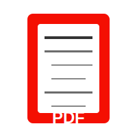
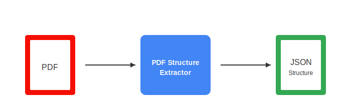
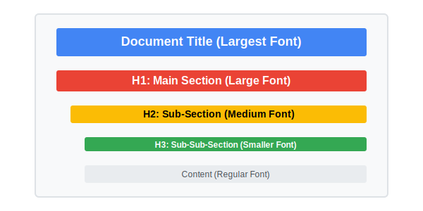
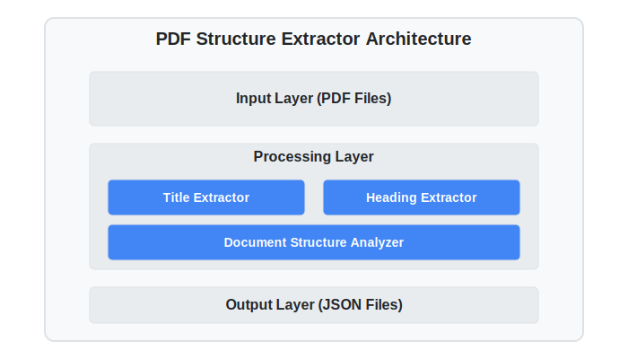

# PDF Document Structure Extractor

<div align="center">



**A high-performance, containerized solution for extracting structured data from PDF documents**

[](https://www.docker.com/)
[](https://www.python.org/)
[](https://opensource.org/licenses/MIT)

</div>

## 📋 Overview

This solution extracts the structured outline of PDF documents, including the title and hierarchical headings (H1, H2, H3) with their respective page numbers. It's designed to work completely offline without any internet access and can process PDFs up to 50 pages efficiently, meeting strict performance requirements.

<div align="center">

</div>

## 🚀 Key Features

- **Offline Processing**: Works without internet access
- **High Performance**: Processes 50-page PDFs in under 10 seconds
- **Multilingual Support**: Extracts structure from PDFs in various languages
- **Containerized**: Runs in an isolated Docker environment
- **Resource Efficient**: Low memory footprint (< 200MB)
- **Cross-Platform**: Compatible with AMD64 architecture

## 🔍 Extraction Approach

### Title Extraction

- Analyzes the first page of the PDF
- Identifies text with the largest font size as the potential title
- Applies heuristics to clean and validate the title
- Falls back to filename if no title can be extracted

### Heading Extraction

- Extracts text elements with their font properties (size, bold, italic) from all pages
- Filters potential headings based on font size, position, and content
- Classifies headings into H1, H2, H3 based on their relative font sizes and styles
- Sorts headings by page number and position on the page

<div align="center">

</div>

## 📊 Output Format

Generates a JSON file with the following structure:

```json
{
  "title": "Document Title",
  "outline": [
    { "level": "H1", "text": "Introduction", "page": 1 },
    { "level": "H2", "text": "What is AI?", "page": 2 },
    { "level": "H3", "text": "History of AI", "page": 3 },
    { "level": "H2", "text": "Applications", "page": 4 }
  ]
}
```
## Project Structure
```
adobe-hackathon-1a
├── assets
│ ├── architecture.svg
│ ├── document-structure.svg
│ ├── pdf-icon.svg
│ └── workflow.svg
│
├── input
│ ├── file01.pdf
│ ├── file02.pdf
│ ├── file03.pdf
│ ├── file04.pdf
│ ├── file05.pdf
│ ├── test_complex.pdf
│ ├── test_multilingual.pdf
│ └── Test_simple.pdf
│
├── output
│ ├── file01.json
│ ├── file02.json
│ ├── file03.json
│ ├── file04.json
│ ├── file05.json
│ ├── test_complex.json
│ ├── test_multilingual.json
│ └── Test_simple.json
│
├── src
│ ├── pycache/
│ ├── init.py
│ ├── extractor.py
│ ├── main.py
│ ├── pdf_processor.py
│ └── utils.py
│
├── build_and_run.bat
├── Dockerfile
├── README.md
└── requirements.txt
```
## 🛠️ Technical Implementation

### Libraries Used

- **PyMuPDF (fitz)**: Primary PDF parsing and analysis
- **PyPDF2**: For supplementary PDF operations
- **pdfminer.six**: For detailed text extraction and analysis
- **Pillow**: For image processing support
- **NumPy**: For numerical operations

### Architecture

<div align="center">

</div>

## 🚀 Building and Running

### Prerequisites

- Docker installed on your system
- PDF files to process

### Quick Start

On Windows, simply run the provided batch file:

```bash
build_and_run.bat
```

This will build the Docker image and run the container with the appropriate volume mappings.

### Manual Build and Run

#### Build the Docker Image

```bash
docker build --platform linux/amd64 -t pdf-structure-extractor:latest .
```

#### Run the Container

```bash
# On Linux/Mac
docker run --rm -v $(pwd)/input:/app/input -v $(pwd)/output:/app/output --network none pdf-structure-extractor:latest

# On Windows (PowerShell)
docker run --rm -v "${PWD}\input":/app/input -v "${PWD}\output":/app/output --network none pdf-structure-extractor:latest

# On Windows (CMD)
docker run --rm -v "%cd%\input":/app/input -v "%cd%\output":/app/output --network none pdf-structure-extractor:latest
```

### Input/Output

- Place your PDF files in the `input` directory
- The extracted structure will be saved as JSON files in the `output` directory
- Each output file will have the same name as the input file but with a `.json` extension

## Critical Constraints

- Execution
time: 
≤ 10 seconds for a 50-page
- PDF
Model size:  ≤ 200MB (if used)
- Network:  No internet access
allowed
- Runtime:
Must run on CPU (amd64),
- This solution should run on
the system with 8 CPUs and
16 GB RAM configurations

## 📊 Performance Metrics

- **Processing Speed**: < 10 seconds for a 50-page PDF
- **Memory Usage**: < 200MB
- **CPU Utilization**: Optimized for 8 CPU cores
- **Container Size**: Minimal footprint using Python slim base image

## 🌐 Multilingual Support

- Supports extraction from PDFs in various languages, including:
  - English
  - Japanese
  - Chinese
  - European languages
- Uses font properties rather than language-specific features for extraction

## 📝 License

This project is licensed under the MIT License - see the LICENSE file for details.

## 🤝 Contributing

Contributions are welcome! Please feel free to submit a Pull Request.

---

<div align="center">
<p>Developed for Adobe India Hackathon 2025</p>
</div>