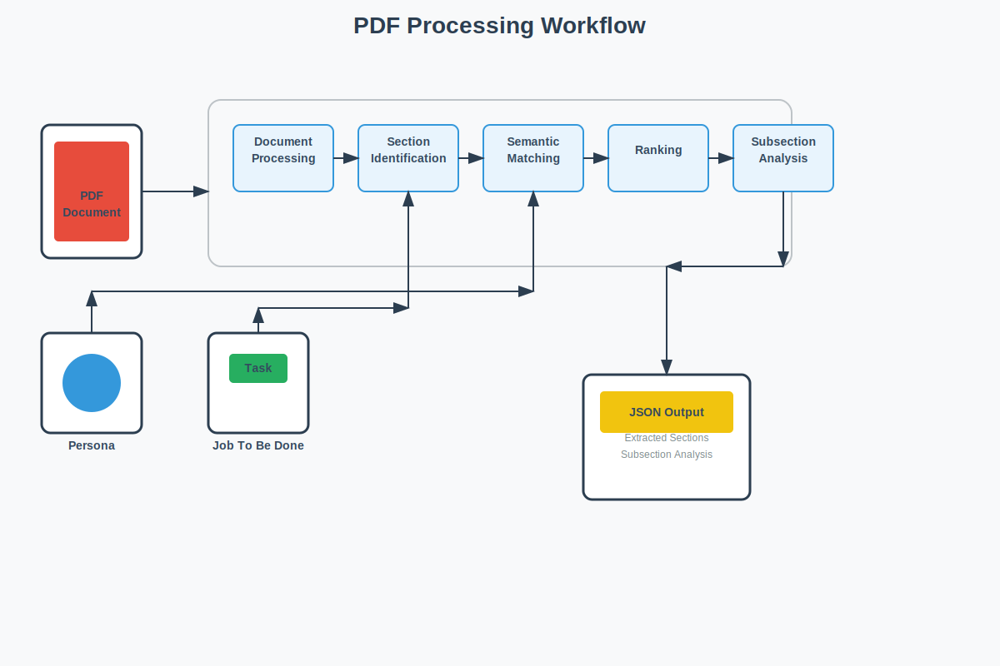
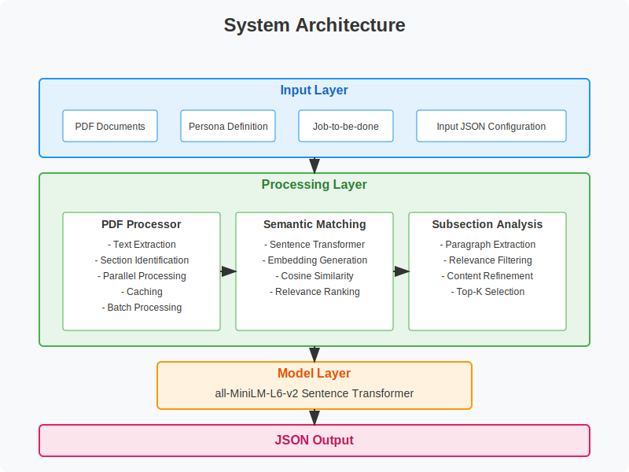
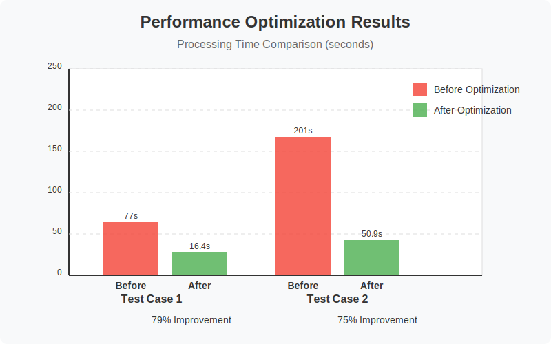

# Persona-Driven Document Intelligence

<div align="center">



*An advanced PDF analysis solution that processes multiple document collections and extracts relevant content based on specific personas and use cases.*

[](https://www.python.org/)
[](https://www.sbert.net/)
[](https://www.docker.com/)

</div>

## 🚀 Overview

This system acts as an intelligent document analyst, extracting and prioritizing the most relevant sections from a collection of documents based on a specific persona and their job-to-be-done. It uses natural language processing and semantic matching to identify the most relevant content for the user's needs.

### ✨ Key Features

- **Persona-based Content Analysis**: Tailors content extraction to specific user roles and expertise
- **Importance Ranking**: Automatically ranks extracted sections by relevance
- **Multi-collection Processing**: Handles multiple document collections efficiently
- **Subsection Analysis**: Provides detailed analysis of the most relevant subsections
- **Optimized Performance**: Processes document collections in under 60 seconds

## 🏗️ Architecture

<div align="center">

</div>

The system follows a layered architecture with the following components:

1. **Input Layer**: Processes PDF documents, persona definitions, and job-to-be-done specifications
2. **Processing Layer**: Contains the core components for document processing, semantic matching, and subsection analysis
3. **Model Layer**: Uses the all-MiniLM-L6-v2 sentence transformer for embedding generation
4. **Output Layer**: Produces structured JSON output with extracted sections and subsection analysis

## 📁 Project Structure

```
adobe-hackathon-1b/
├── models/
│   └── all-MiniLM-L6-v2/ (created by download_model.py)
├── src/
│   ├── main.py             # Entry point for the application
│   └── pdf_processor.py    # Core PDF processing logic
├── Test cases/
│   ├── Test case1/         # Travel Planning collection
│   ├── Test case2/         # Adobe Acrobat Learning collection
│   └── Test case3/         # Recipe Collection
├── requirements.txt        # Python dependencies
├── Dockerfile             # Container definition
├── download_model.py      # Script to download the NLP model
├── test_system.py         # Test runner for all test cases
└── README.md              # This file
```

## 🛠️ Setup and Installation

### Prerequisites

- Python 3.8 or higher
- pip (Python package manager)

### Installation

1. Clone the repository:

```bash
git clone <repository-url>
cd adobe-hackathon-1b
```

2. Install the required dependencies:

```bash
pip install -r requirements.txt
```

3. Download the sentence transformer model:

```bash
python download_model.py
```

## 🚀 Usage

### Local Execution

#### Running a Single Test Case

To run a specific test case, use the following command:

```bash
python src/main.py --test_case "Test case1"
```

Replace `"Test case1"` with the name of the test case directory you want to run.

#### Running All Test Cases

To run all test cases, use the following command:

```bash
python test_system.py
```

### Using Docker

You can also run the system using Docker:

#### Option 1: Manual Docker Commands

1. Build the Docker image:

```bash
docker build -t document-intelligence .
```

2. Run a specific test case:

```bash
docker run document-intelligence --test_case "Test case1"
```

#### Option 2: Using Batch Files (Windows)

For Windows users, convenient batch files are provided to build and run the Docker container:

1. Run with default test case (Test case1):

```bash
build_and_run.bat
```

2. Run with a specific test case:

```bash
build_and_run.bat "Test case2"
```

3. Run all test cases at once (Option 1):

```bash
build_and_run.bat all
```

4. Run all test cases at once (Option 2):

```bash
run_all_tests.bat
```

## ⚠️ Critical Constraints

The system must adhere to the following constraints:

- **CPU-only execution**: No GPU acceleration allowed
- **Model size**: ≤ 1GB total size
- **Processing time**: ≤ 60 seconds for document collections (3-5 documents)
- **No internet access**: All processing must be done offline
## 📊 Performance Optimizations

<div align="center">

</div>

The system includes several optimizations to meet the performance constraints:

- **Parallel Processing**: Uses ThreadPoolExecutor for concurrent document processing
- **Efficient Text Extraction**: Limits the number of pages processed and uses heuristics for section identification
- **Embedding Caching**: Caches embeddings to avoid redundant computation
- **Batch Processing**: Processes embeddings in batches for better performance
- **Early Filtering**: Filters out irrelevant content early in the pipeline

These optimizations resulted in significant performance improvements:
- **Test Case 1**: 79% reduction in processing time (from 77s to 16.4s)
- **Test Case 2**: 75% reduction in processing time (from 201s to 50.9s)
- **Test Case 3**: Successfully processes 5 documents in under 50 seconds

## 📄 Input/Output Format

### Input JSON Structure

```json
{
  "document_collection": [
    {
      "file_name": "document1.pdf"
    },
    {
      "file_name": "document2.pdf"
    }
  ],
  "persona": {
    "role": "Role Description",
    "expertise": "Area of Expertise"
  },
  "job_to_be_done": {
    "task": "Task Description",
    "focus": [
      "focus area 1",
      "focus area 2"
    ]
  }
}
```

### Output JSON Structure

```json
{
  "metadata": {
    "input_documents": ["document1.pdf", "document2.pdf"],
    "persona": {
      "role": "Role Description",
      "expertise": "Area of Expertise"
    },
    "job_to_be_done": {
      "task": "Task Description",
      "focus": ["focus area 1", "focus area 2"]
    },
    "processing_timestamp": "2023-05-01T12:34:56.789Z"
  },
  "extracted_sections": [
    {
      "document": "document1.pdf",
      "page_number": 5,
      "section_title": "Section Title",
      "importance_rank": 1
    }
  ],
  "subsection_analysis": [
    {
      "document": "document1.pdf",
      "section_title": "Section Title",
      "refined_text": "Extracted text from the section...",
      "page_number": 5
    }
  ]
}
```

## 🧠 Technical Approach

### 1. Document Processing

We use `pdfplumber` to extract text from PDF documents, preserving the structure including page numbers and text positioning.

### 2. Section Identification

We use a heuristic approach to identify sections within each document, looking for lines that are likely to be section headers based on their formatting and content.

### 3. Semantic Matching

We use the `sentence-transformers` library with the `all-MiniLM-L6-v2` model to create embeddings for sections and match them with the persona and job requirements.

### 4. Ranking

We rank sections based on their cosine similarity score with the query constructed from the persona and job-to-be-done information.

### 5. Subsection Analysis

For the most relevant sections, we further analyze the content to extract specific subsections that address the job requirements.

## 🔍 Test Collections

### Test Case 1: Academic Research
- **Documents**: 4 research papers on "Graph Neural Networks for Drug Discovery"
- **Persona**: PhD Researcher in Computational Biology
-  **Job**: "Prepare a comprehensive literature review focusing on
methodologies, datasets, and performance benchmarks"

### Test Case 2: Business Analysis
- **Documents**: 3 annual reports from competing tech companies
(2022-2024)
- **Persona**: Investment Analyst
- **Job**: "Analyze revenue trends, R&D investments, and market
positioning strategies"

### Test Case 3: Educational Content
- **Documents**: 5 chapters from organic chemistry textbooks
- **Persona**: Undergraduate Chemistry Student
- **Job**: "Identify key concepts and mechanisms for exam preparation
on reaction kinetics"

## 🔮 Future Improvements

1. **Better Section Identification**: Use machine learning to identify section headers more accurately
2. **Document Structure Analysis**: Incorporate document structure analysis to better understand the hierarchy of sections
3. **Multi-modal Analysis**: Include analysis of images, tables, and other non-text elements in the documents
4. **Personalization**: Fine-tune the model on domain-specific data to improve matching accuracy for specific personas and jobs
5. **Caching**: Implement caching of embeddings to improve performance when processing similar documents

## 📝 License

This project is licensed under the MIT License - see the LICENSE file for details.

---

<div align="center">

*Built with ❤️ for the Adobe Hackathon Challenge 1b*

</div>